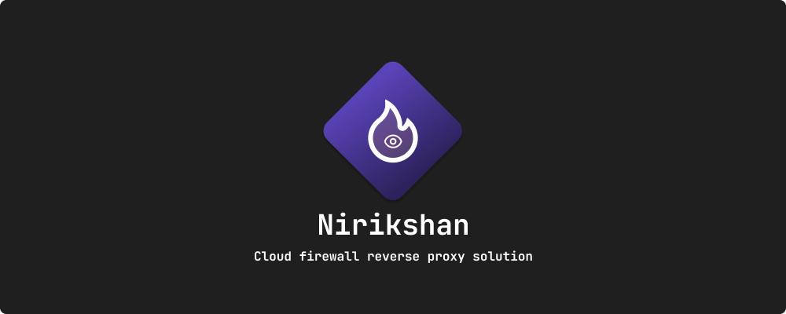
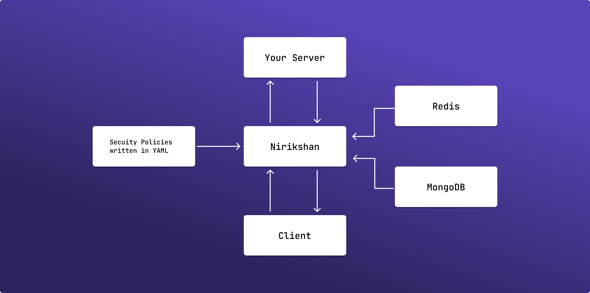
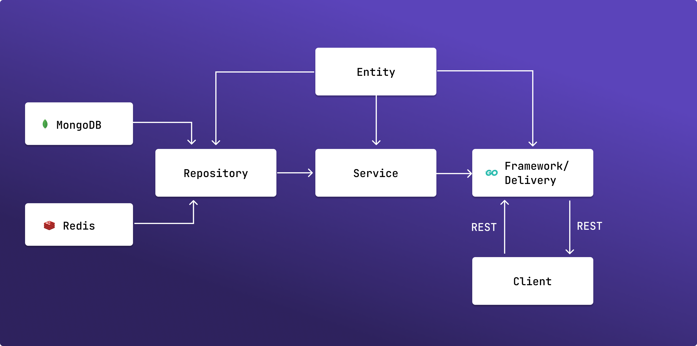

[](https://github.com/Shastram/nirikshan/blob/master/LICENSE)
[](https://github.com/Shastram/nirikshan/issues/new/choose)

# Nirikshan

> A declarative Cloud firewall reverse proxy solution with inbuilt DDoS protection and alerting mechanism to protect your servers and keeping an eye on those malicious requests

## 🤔 What is Nirikshan?

Nirikshan is an cloud firewall reverse proxy with an inbuilt ddos prevention and alerting solution. Does that sound complex? Let's break it down.

- **Cloud:** A system/server that is sitting on the cloud
- **Firewall:** A system that denies/allows a packet based on some instruction and conditional logic
- **Reverse Proxy:** A system that sits in-front of your actual server and forward the request to your actual server safely
- **DDoS Protection:** A system that detects DDoS and contains the attack
- **Alerting:** A system that someone notifies you when it has detected that something has gone wrong

Nirikshan is a combination of all these! Yes, you read that right.

Imagine you wanted to block people using iPhone to access your server, or people using Chrome or accessing from IPs of specific location. You can do that all with Nirikshan!

To top it off, there is an inbuilt ddos and rate-limiting mechanism, so if anything suspcious occurs, the Nirikshan Telegram bot will immedietly alert you with all the details after which you can use the companion [Nirikshan Rekon App](https://github.com/Shastram/nirikshan-rekon-app) to monitor and take action.

What are the major advantages of using Nirikshan?

- **Declarative security policies using YAML**
- Has an companion App that you can use to monitor the requests
- Has an Telegram Bot that will immedieatly alert you if something goes wrong

What are some upcoming features?

- Promethues and Grafana support for better analysis
- Packet analysis to ensure no secrets are being leaked
- Slack and Discord support

## 💻 Usage



### Why is Nirikshan required?

With Nirikshan you can do the following:

- Block any OS(s)from accessing your server
- Block any specific browsers from accessing your server
- Block any device type from accessing your server
- Block all requests for specific time in a day (eg: 11PM-12PM)
- Blacklist IP addresses from accesing your server
- Block specific routes dynamically to contain violations
- Rate limit and ddos protect your server
- Monitor all the requests to your server
- Analyse and dynamically apply security policies on the fly
- Get notified for any sort of policy violation events

With this level of granularity you have full access to the networking from outside world to your server which are sending requests.

## ⬇ Installation

- Go to Telegram and interact with the Nirikshan Bot [here](http://t.me/nirikshan_bot)
- Send the command `/getid` to get your chat ID
- Now clone the repository using the following command

```bash
git clone https://github.com/Shastram/nirikshan
```

### Writting Security Policies

- Open the file `config.yaml` and write the security policies you wish to write, to add multiple site, just copy the siteData node and populate it with your own values

```yaml
nirikshanVersion: 1.0.0
siteConfigs:
  - siteData:
      siteName: "google" # The name of the route
      forwardingUrl: "https://google.com" # Where the request should be forward
      blockedOs:
        - "iOS" # Add multiple operating systems you wish to block
      blockedBrowser:
        - "Chrome" # Add multiple browsers you wish to block
      blockedDevice:
        - "iPhone"
      blockedOSVersion:
        - "15.1" # Add multiple browsers you wish to block
      blockedLocations:
        - "/create" # You can also block specific path routes
      blockedIPs:
        - "192.168.1.2" # Blacklisted IP addresses
        - "192.168.4.1"
```

### Setting up via Docker Compose

Nirikshan uses the following databases:

- redis, for ddos detection mechanism
- mongodb, for dbms purposes

You can efforlessly run Nirikshan with one command.

Simple run the following command:

```bash
docker-compose up
```

Ensure to replace the `TELEGRAM_BOT_TOKEN` and `TELEGRAM_USER` obtained before cloning the repository in the `docker-compose.yaml` file.

```yaml
environment:
  - JWT_SECRET=nirikshan
  - DB_SERVER=mongodb://mongo:27017
  - DB_USER=root
  - DB_PASSWORD=toor
  - REDIS_SERVER=redis:6379
  - TELEGRAM_BOT_TOKEN=123 # add your telegram bot token here
  - TELEGRAM_USER=123 # add your telegram user id here from the bot
```

### Setup Manually

- Make sure you setup MongoDB and Redis and have thier URLs.
- Populate your environment variables with the following
  ```bash
  JWT_SECRET=nirikshan
  DB_SERVER=mongodb://mongo:27017
  DB_USER=root
  DB_PASSWORD=toor
  REDIS_SERVER=redis:6379
  TELEGRAM_BOT_TOKEN=123 # add your telegram bot token here
  TELEGRAM_USER=123 # add your telegram user id here from the bot
  ```
- Run the server using the following command from the root of the project
  ```bash
  go run api/main.go
  ```

NOTE: Make sure to use the Nirikshan Rekon App to monitor all the logs on the fly!

## 🛠 Architecture and Structure



## ⭐ Show your support

Give a ⭐ if you liked this project!

Spread the word to your fellows to safeguard your API's!

## 🤝 Contributions

- Feel Free to Open a PR/Issue for any feature or bug(s).
- Make sure you follow the [community guidelines](https://docs.github.com/en/github/site-policy/github-community-guidelines)!
- Feel free to open an issue to ask a question/discuss anything about nirikshan.
- Have a feature request? Open an Issue!

## ⚖ License

Copyright 2021 Hemanth Krishna

Licensed under MIT License : https://opensource.org/licenses/MIT

<p align="center">Made with ❤ and multiple cups of coffee</p>

